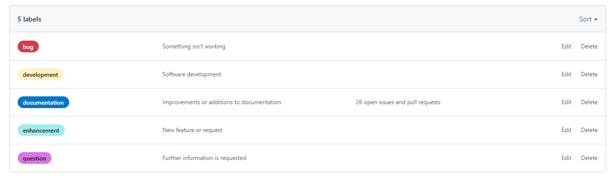

# Metodologia

Pré-requisitos: <a href="2-Especificação do Projeto.md"> Documentação de Especificação</a>

Descreva aqui a metodologia de trabalho do grupo para atacar o problema. Definições sobre os ambiente de trabalho utilizados pela  equipe para desenvolver o projeto. Abrange a relação de ambientes utilizados, a estrutura para gestão do código fonte, além da definição do processo e ferramenta através dos quais a equipe se organiza (Gestão de Times).

## Relação de Ambientes de Trabalho

Os artefatos do projeto são desenvolvidos a partir de diversas plataformas e a relação dos ambientes com seu respectivo propósito é apresentada na tabela que se segue.  

| Ambiente  | Plataforma | Link de Acesso | 
| ------------------- | ----------------|---------------|
|  Repositório de código fonte |  GitHub |  [Firstep / GitHub / Códigos  ](https://github.com/ICEI-PUC-Minas-PMV-ADS/pmv-ads-2023-1-e3-proj-mov-t1-projeto-firstep)            |
|  Documentos do projeto | GitHub |[Firstep / GitHub / Documentos  ](https://github.com/ICEI-PUC-Minas-PMV-ADS/pmv-ads-2023-1-e3-proj-mov-t1-projeto-firstep)                     | 
|  Projeto de Interface e Wireframes | Figma | [Firstep / Figma / Protótipo   ](https://www.figma.com/files/team/1217088730807209021/Firstep?fuid=1153538250564335280)         |
|  Gerenciamento do Projeto |GitHub | [Firstep / GitHub / Gerenciamento de Projeto  ](https://github.com/ICEI-PUC-Minas-PMV-ADS/pmv-ads-2023-1-e3-proj-mov-t1-projeto-firstep)                  |

## Controle de Versão

A ferramenta de controle de versão adotada no projeto foi o
[Git](https://git-scm.com/), sendo que o [Github](https://github.com)
foi utilizado para hospedagem do repositório.

O projeto segue a seguinte convenção para o nome de branches:

- `main`: versão estável já testada do software
- `unstable`: versão já testada do software, porém instável
- `testing`: versão em testes do software
- `dev`: versão de desenvolvimento do software

Quanto à gerência de issues, o projeto adota a seguinte convenção para
etiquetas:

- `bug`: uma funcionalidade encontra-se com problemas
- `development`: funcionalidade em desenvolvimento
- `documentation`: melhorias ou acréscimos à documentação
- `enhancement`: uma funcionalidade precisa ser melhorada
- `question` : quando há dúvidas sobre o processo.

## Gerenciamento de Projeto

### Divisão de Papéis

Apresente a divisão de papéis entre os membros do grupo.

 A equipe utiliza metodologias ágeis, tendo escolhido o Scrum como base para definição do processo de desenvolvimento. 

A equipe está organizada da seguinte maneira: 

**Scrum Master:** Karen Noguti

**Product Owner:** Douglas Raynner

**Equipe de Desenvolvimento:** 
- Carolina Laurindo,
- Cláudia Carapiá, 
- Douglas Raynner, 
- Jeferson Queiroz,
- Jéssica Grimaldi,
- Karen Noguti

**Equipe de Design:** 
- Jeferson Queiroz da Silva,
- Jéssica Grimaldi

### Processo

Para organização e distribuição das tarefas do projeto, a equipe está utilizando o GitHub estruturado com as seguintes listas:

● **Recursos:** Esta lista mantém template de tarefas recorrentes com as configurações padronizadas que todos devem seguir. O objetivo é permitir a cópia destes templates para agilizar a criação de novos cartões.

● **Product Backlog:** Recebe as tarefas a serem trabalhadas e representa o Product Backlog. Todas as atividades identificadas no decorrer do projeto também devem ser incorporadas a esta lista.

● **To Do:** Esta lista representa o Sprint Backlog. Este é o Sprint atual que estamos trabalhando.

● **In Progress:** Quando uma tarefa tiver sido iniciada, ela é movida para cá.

● **Done:** Nesta lista são colocadas as tarefas que passaram pelos testes e controle de qualidade e estão prontos para ser entregues ao usuário. Não há mais edições ou revisões necessárias, ele está agendado e pronto para a ação.

O quadro kanban do grupo no GitHub está disponível através da URL [Planejamento](https://github.com/orgs/ICEI-PUC-Minas-PMV-ADS/projects/241) e é apresentado, no estado atual, na Figura X. A definição desta estrutura se baseou na proposta feita por Littlefield (2016).

Figura X - Tela do Kanban utilizado pelo grupo

> **Links Úteis**:
> - [Planejamento e Gestáo Ágil de Projetos](https://pucminas.instructure.com/courses/87878/pages/unidade-2-tema-2-utilizacao-de-ferramentas-para-controle-de-versoes-de-software)
> - [Sobre quadros de projeto](https://docs.github.com/pt/issues/organizing-your-work-with-project-boards/managing-project-boards/about-project-boards)
> - [Project management, made simple](https://github.com/features/project-management/)
> - [Sobre quadros de projeto](https://docs.github.com/pt/github/managing-your-work-on-github/about-project-boards)
> - [Como criar Backlogs no Github](https://www.youtube.com/watch?v=RXEy6CFu9Hk)
> - [Tutorial Slack](https://slack.com/intl/en-br/)

### Ferramentas

As ferramentas empregadas no projeto são: 

- Editor de código
- Ferramentas de comunicação 
- Ferramentas de desenho de tela (wireframing) 
- Repositório 
- Ferramenta de criação de diagramas 
- Ferramenta de versionamento de código 

O editor de código  foi escolhido porque ele possui integração com o Git e GitHub. 

A ferramenta de comunicação utilizada é completa e de fácil acesso, sendo assim, viável para comunicar por computador e smartphone, além de ser possível o compartilhamento de tela para que o grupo consiga visualizar e contribuir na execução de etapas do projeto de forma simultânea. 

A ferramenta de desenho de telas é bem completa e pode ser usada de forma gratuita, além de possibilitar a edição simultânea de telas por diferentes membros do grupo. 

O repositório utilizado foi definido pela faculdade e é o mais moderno e usual, funcionando bem com Git. 

A ferramenta de criação de diagramas foi escolhida devido a usabilidade, gratuidade e a facilidade, atendendo assim, a demanda de criações de diagramas por todo o projeto. 

A ferramenta de versionamento de código foi escolhida devido a fácil utilização, modernidade e por  funcionar muito bem com o repositório que foi definido pela faculdade. 

 

|Função    | Plataforma  | Link de Acesso |
|------|-----------------------------------------|----|
| Editor de código | Visual Studio Code | [visualstudio](https://visualstudio.microsoft.com/pt-br/)|
| Ferramenta de comunicação | Microsoft Teams | [MicrosoftTeams](https://teams.microsoft.com/) |
| Ferramenta de desenho de telas | Figma | [figma](https://www.figma.com/file/LD9PrEobwuYqLz5e2xDQt7/)|
| Repositório | GitHub | [github](https://github.com/ICEI-PUC-Minas-PMV-ADS/pmv-ads-2023-1-e3-proj-mov-t1-projeto-firstep)|
| Ferramenta de criação de diagramas | Camunda | [camunda](https://modeler.cloud.camunda.io/diagrams/f243c63c-5c29-46b2-afc8-dfdf46457393--new-bpmn-diagram?v=756,277,1)|
| Ferramenta de versionamento de códigos | Git | [git](https://git-scm.com/) |

  
 
