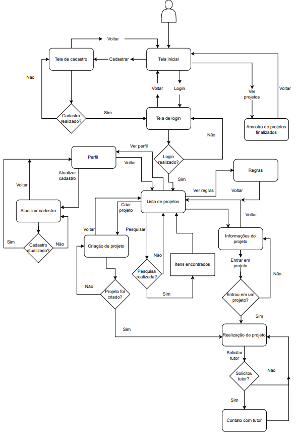
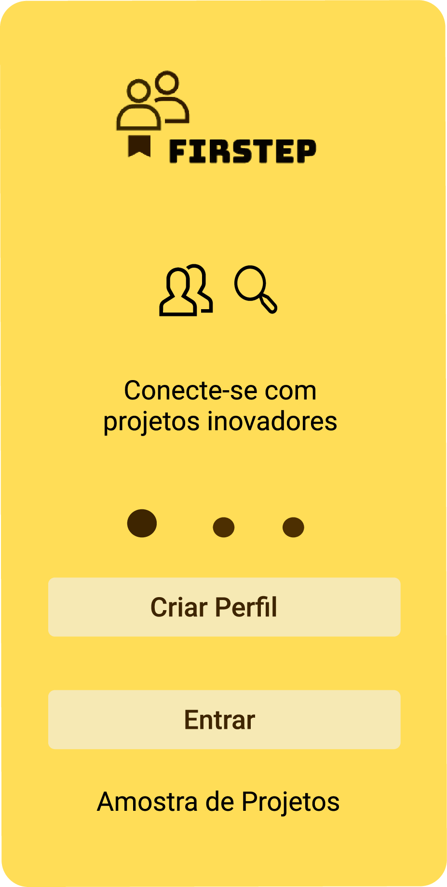
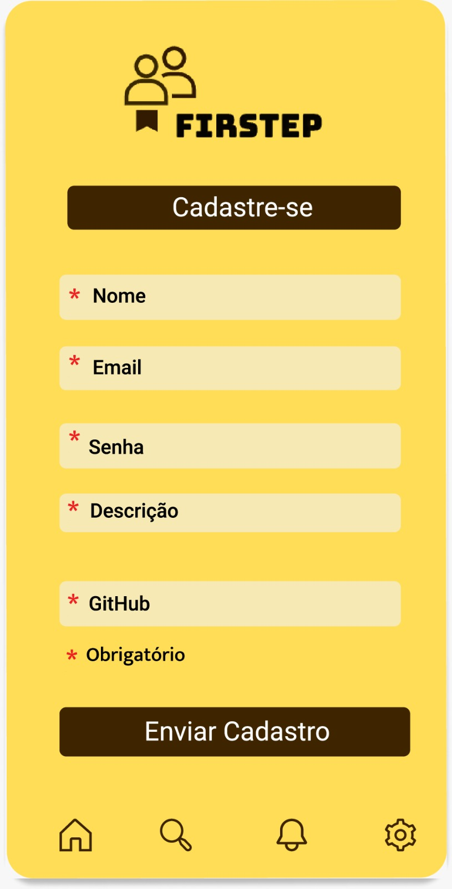
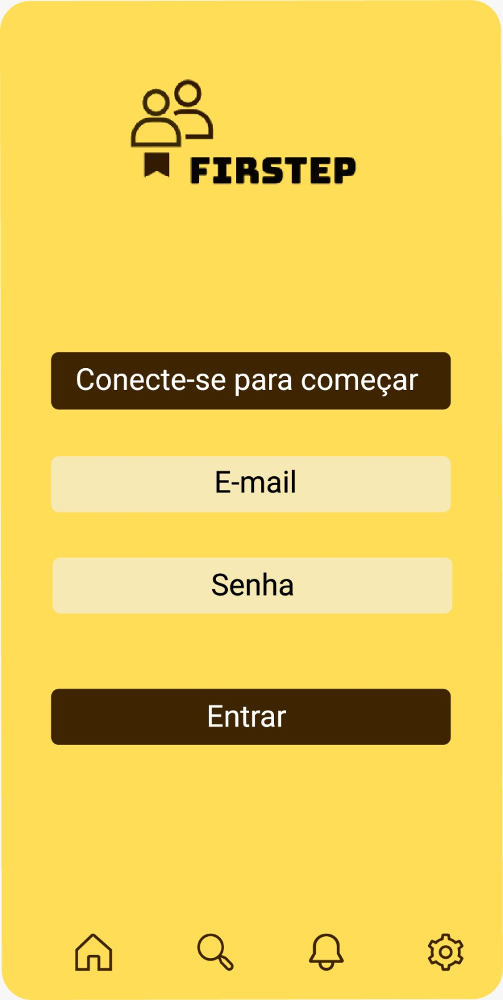
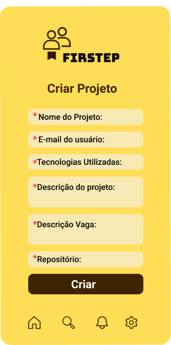
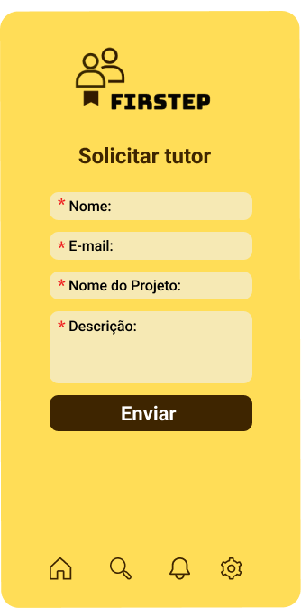
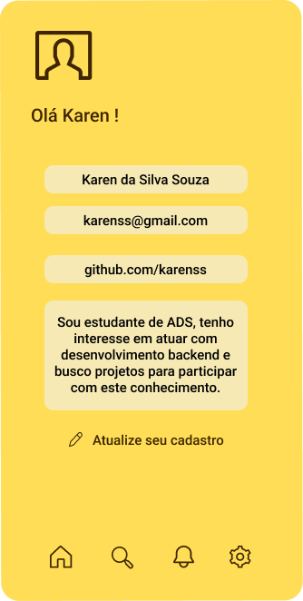
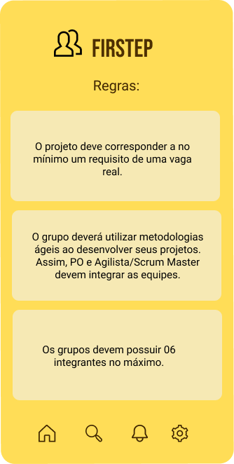
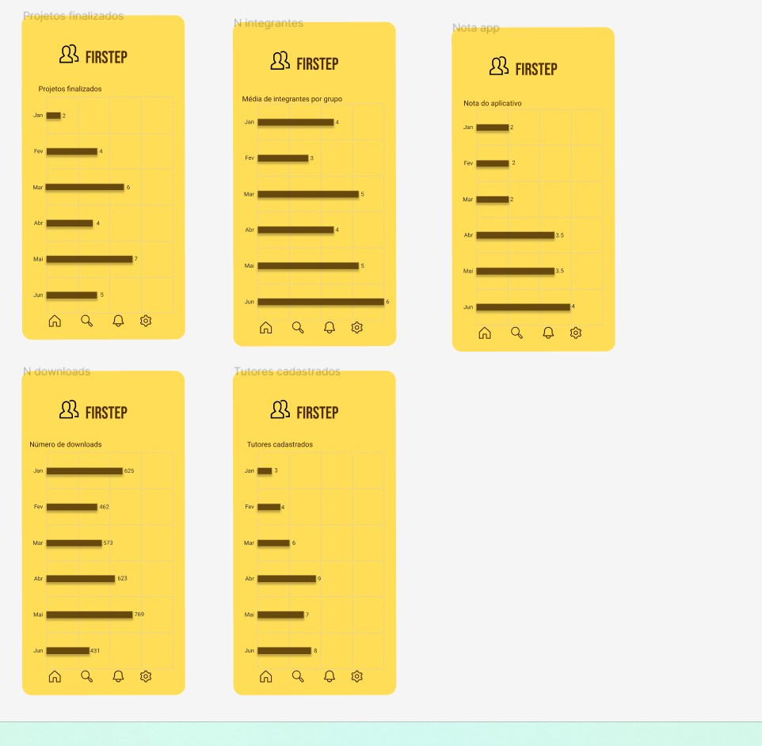
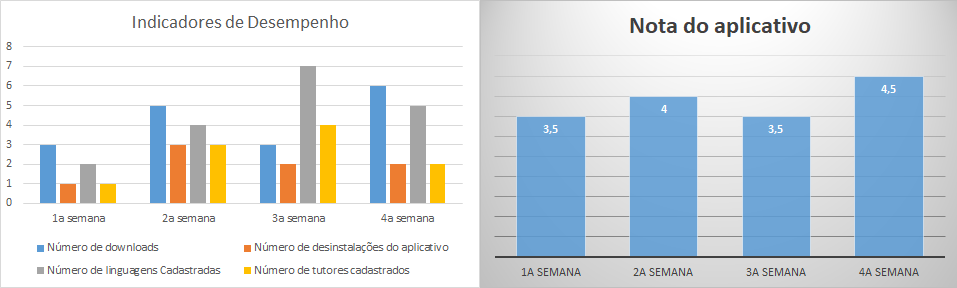

# Projeto de Interface

Pré-requisitos: <a href="2-Especificação do Projeto.md"> Documentação de Especificação</a>

Visão geral da interação do usuário pelas telas do sistema e protótipo interativo das telas com as funcionalidades que fazem parte do sistema (wireframes).

 Apresente as principais interfaces da plataforma. Discuta como ela foi elaborada de forma a atender os requisitos funcionais, não funcionais e histórias de usuário abordados nas <a href="2-Especificação do Projeto.md"> Documentação de Especificação</a>.

## Diagrama de Fluxo

O diagrama apresenta o estudo do fluxo de interação do usuário com o sistema interativo e  muitas vezes sem a necessidade do desenho do design das telas da interface. Isso permite que o design das interações seja bem planejado e gere impacto na qualidade no design do wireframe interativo que será desenvolvido logo em seguida.

O diagrama de fluxo pode ser desenvolvido com “boxes” que possuem internamente a indicação dos principais elementos de interface - tais como menus e acessos - e funcionalidades, tais como editar, pesquisar, filtrar, configurar - e a conexão entre esses boxes a partir do processo de interação.

## Wireframes

## Tela de Página Inicial

Esta tela  permite o direcionamento para as páginas Login, Cadastros e Amostra de Projetos.

   

## Tela de Amostra de projetos

Esta tela mostra ao usuário, cadastrado ou não, todos os projetos cadastrados no aplicativo, finalizados e em andamento.

## Tela de Cadastro de Usuário

Esta tela  permite que o usuário realize seu cadastro.

    

## Tela de Login

Esta tela  permite que o usuário realize seu Login.

    

## Tela pós login

Esta tela mostra ao usuário os projetos que estão em aberto para que ele possa participar

## Atualização de Cadastro

Esta tela  permite o usuário editar o seu cadastro.

   

## Tela de Cadastro de Projeto

Esta tela permite o cadastro de um projeto. 

   

## Tela de Solicitação de Tutor

Esta tela permite que o usuário solicite um tutor.  

   

## Tela de Perfil

Esta tela indica o Perfil do usuário, com as informações cadastradas anteriormente por ele.

   

## Tela de Regras

Esta tela informa as regras de participação e inserção de projetos no aplicativo.

   

## Telas de Indicadores

Estas telas exibem gráficos onde o administrador do aplicativo pode visualizar diversos dados do App.

# Gráficos de indicadores de desempenho

