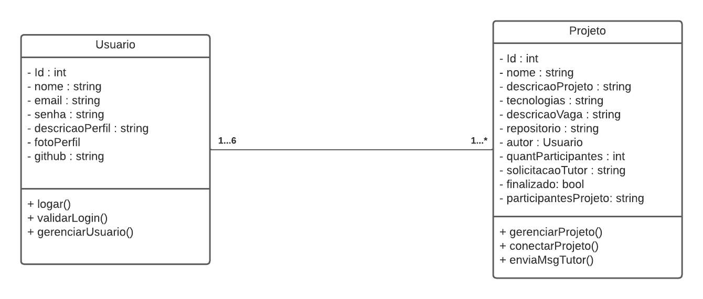
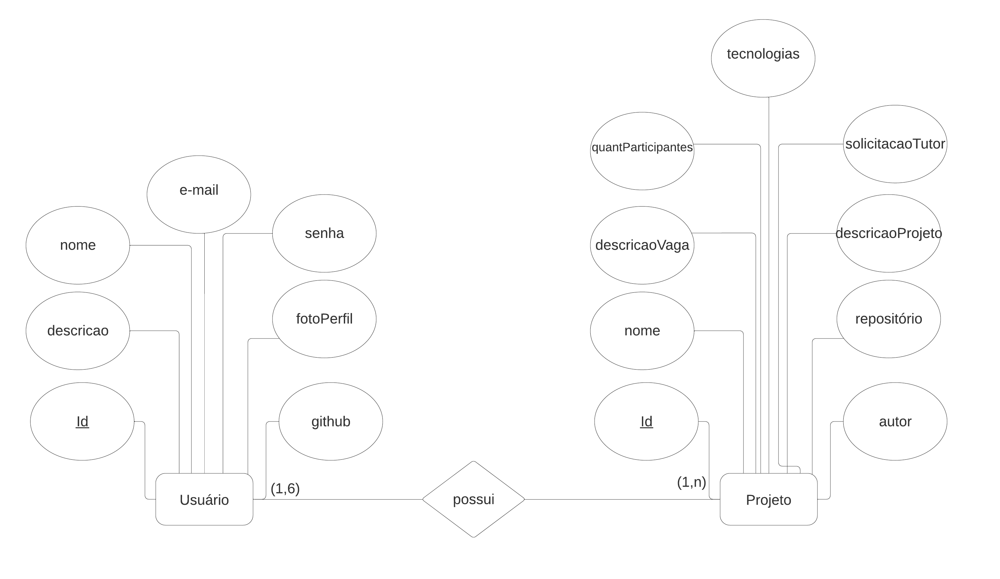
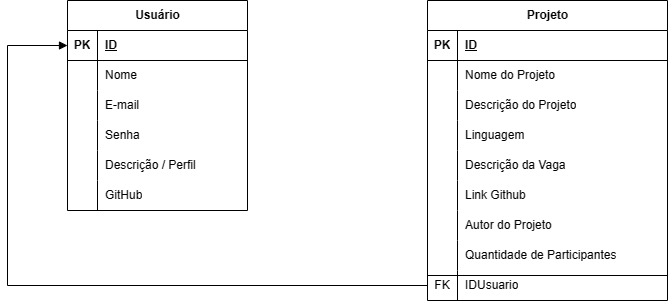

# Arquitetura da Solução

Pré-requisitos: <a href="3-Projeto de Interface.md"> Projeto de Interface</a>

Definição de como o software é estruturado em termos dos componentes que fazem parte da solução e do ambiente de hospedagem da aplicação.

## Diagrama de Classes

O diagrama de classes ilustra graficamente como será a estrutura do software, e como cada uma das classes da sua estrutura estarão interligadas. Essas classes servem de modelo para materializar os objetos que executarão na memória.

## Modelo ER

O Modelo ER representa através de um diagrama como as entidades (coisas, objetos) se relacionam entre si na aplicação interativa.

 

## Esquema Relacional

O Esquema Relacional corresponde à representação dos dados em tabelas juntamente com as restrições de integridade e chave primária.

 

 Usuário(IDUsuario (PK), Nome, E-mail (UNIQUE), Senha, Descrição / Perfil, Github)

 Projeto (IDProjeto (PK), IDUsuario (FK), Nome do Projeto, Descrição do Projeto, Linguagem, Descrição da Vaga, Link Github, Autor do Projeto, Quantidade de Participantes)

## Modelo Físico

Entregar um arquivo banco.sql contendo os scripts de criação das tabelas do banco de dados. Este arquivo deverá ser incluído dentro da pasta src\bd.

## Tecnologias Utilizadas

|Função    | Tecnologia  | 
|------------|-----------------------------------------|
| Linguagem | JavaScript | 
| Framework | ReactNative | 
| Bibliotecas | React Native Paper, React Navigation, Json server | 
| IDE | Visual Studio Code | 
| Ferramentas | Microsoft Teams, GitHub | 
| Banco de dados | MySQL | 

 

## Hospedagem

A hospedagem será realizada no Snack, serviço oferecido pelo aplicativo Expo Go.

## Qualidade de Software

Conceituar qualidade de fato é uma tarefa complexa, mas ela pode ser vista como um método gerencial que através de procedimentos disseminados por toda a organização, busca garantir um produto final que satisfaça às expectativas dos stakeholders.

No contexto de desenvolvimento de software, qualidade pode ser entendida como um conjunto de características a serem satisfeitas, de modo que o produto de software atenda às necessidades de seus usuários. Entretanto, tal nível de satisfação nem sempre é alcançado de forma espontânea, devendo ser continuamente construído. Assim, a qualidade do produto depende fortemente do seu respectivo processo de desenvolvimento.

A norma internacional ISO/IEC 25010, que é uma atualização da ISO/IEC 9126, define oito características e 30 subcaracterísticas de qualidade para produtos de software.
Com base nessas características e nas respectivas sub-características, identifique as sub-características que sua equipe utilizará como base para nortear o desenvolvimento do projeto de software considerando-se alguns aspectos simples de qualidade. Justifique as subcaracterísticas escolhidas pelo time e elenque as métricas que permitirão a equipe avaliar os objetos de interesse.
|Característica de Qualidade| Subcaracteristicas |Justificativa      |
|--------------------|------------------------------------|----------------------------------------|
| ● Funcionalidade              O conjunto de funções satisfazem as necessidades explícitas e implícitas para a finalidade a que se destina o produto?  |         Adequação Funcional.      |Propõe-se a fazer o que é apropriado.
| ● Eficiência                          Os recursos e os tempos utilizados são compatíveis com o nível de desempenho requerido para o produto.  |   Eficiência de Desempenho Comportamento em relação ao tempo.            |   Essa característica representa o desempenho em relação à quantidade de recursos utilizados nas condições estabelecidas.
|● Compatibilidade    |        Coexistência; Interoperabilidade.       |   Grau em que um produto, sistema ou componente pode trocar informações com outros produtos, sistemas ou componentes e/ou desempenhar suas funções necessárias enquanto compartilha o mesmo ambiente de hardware ou software.
|● Usabilidade                             É fácil utilizar o software?    |    Inteligibilidade.         Apreensibilidade.         Operacionalidade.     |   É fácil entender os conceitos utilizados?       É fácil aprender a usar?      É fácil de operar e controlar a operação?
| ● Manutenibilidade   |   Modularidade; Reutilização; Analisabilidade; Modificabilidade; Testabilidade.            |   Essa característica representa o grau de eficácia e eficiência com que um produto ou sistema pode ser modificado para melhorá-lo, corrigi-lo ou adaptá-lo às mudanças no ambiente e nos requisitos.
| ● Portabilidade  |   É possível utilizar o produto em diversas plataformas com pequeno esforço de adaptação.            |É fácil instalar em outros ambientes?    É fácil substituir por outro software?    Está de acordo com padrões ou convenções de portabilidade?
> **Links Úteis**:
>
> - [ISO/IEC 25010:2011 - Systems and software engineering — Systems and software Quality Requirements and Evaluation (SQuaRE) — System and software quality models](https://www.iso.org/standard/35733.html/)
> - [Análise sobre a ISO 9126 – NBR 13596](https://www.tiespecialistas.com.br/analise-sobre-iso-9126-nbr-13596/)
> - [Qualidade de Software - Engenharia de Software 29](https://www.devmedia.com.br/qualidade-de-software-engenharia-de-software-29/18209/)
