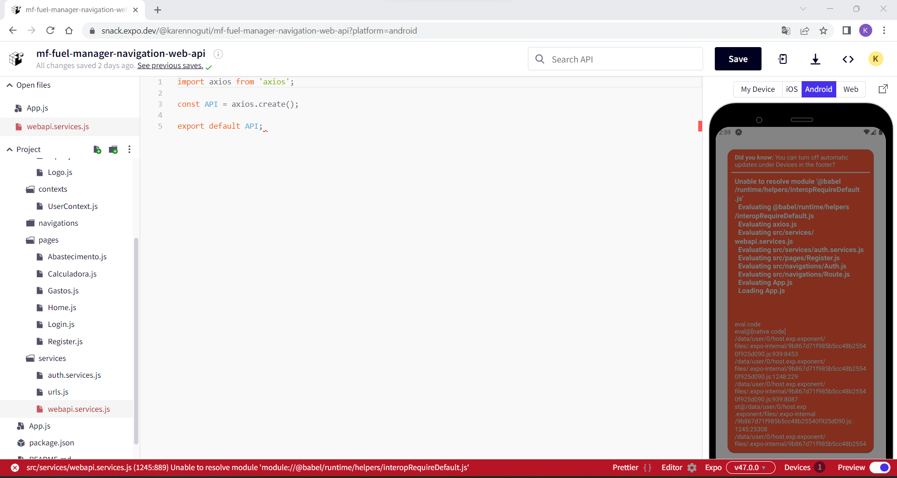
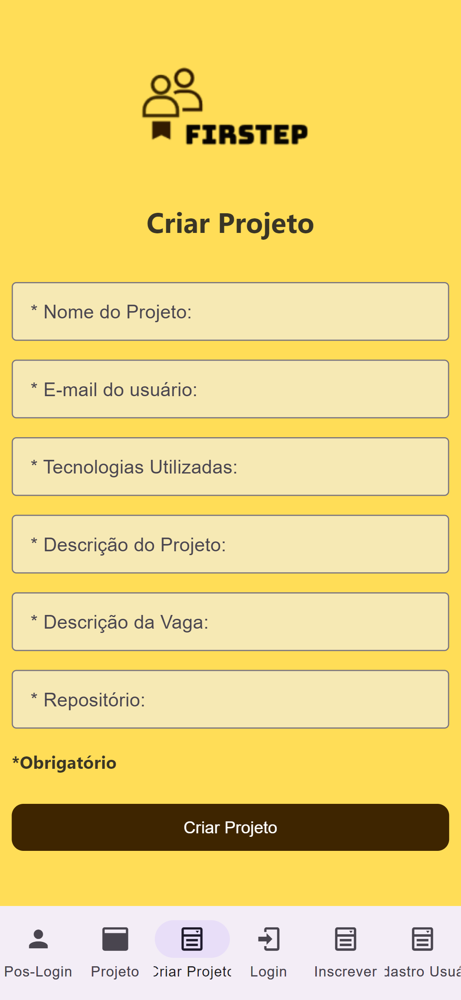
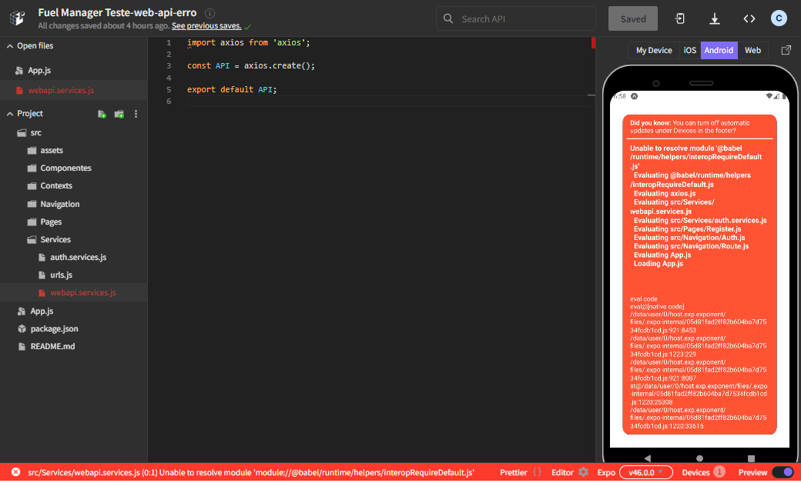
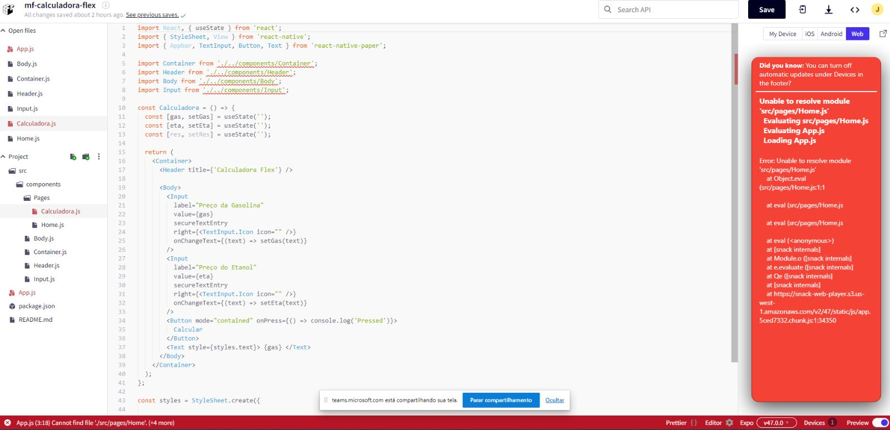
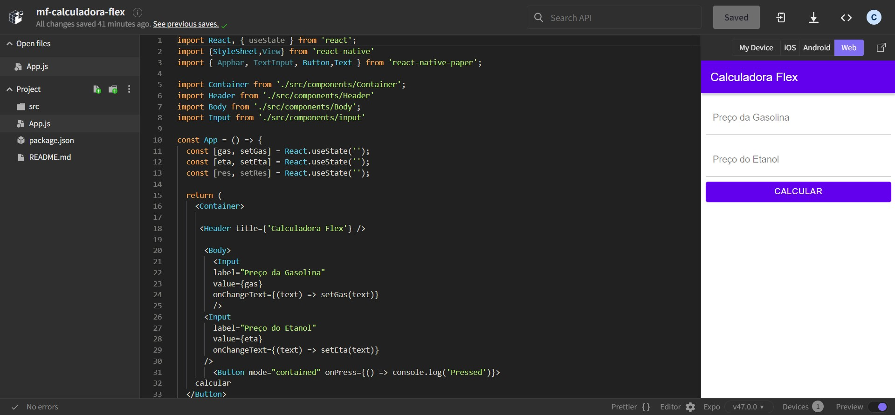
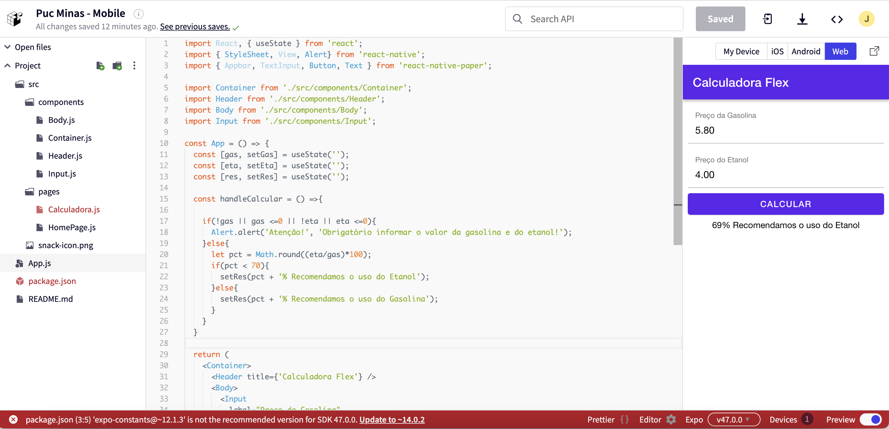
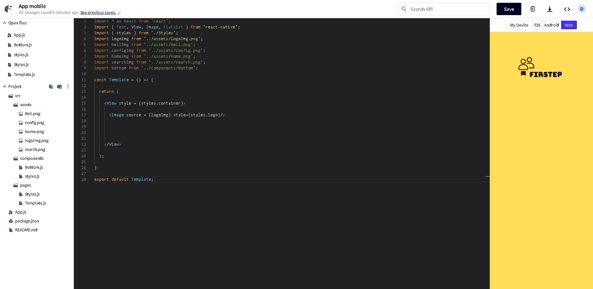

# Programação de Funcionalidades

Pré-requisitos: <a href="2-Especificação do Projeto.md"> Especificação do Projeto</a>, <a href="3-Projeto de Interface.md"> Projeto de Interface</a>, <a href="4-Metodologia.md"> Metodologia</a>, <a href="3-Projeto de Interface.md"> Projeto de Interface</a>, <a href="5-Arquitetura da Solução.md"> Arquitetura da Solução</a>

Implementação do sistema descritas por meio dos requisitos funcionais e/ou não funcionais. Deve relacionar os requisitos atendidos os artefatos criados (código fonte) além das estruturas de dados utilizadas e as instruções para acesso e verificação da implementação que deve estar funcional no ambiente de hospedagem.

Para cada requisito funcional, pode ser entregue um artefato desse tipo

## Tela Informações do Projeto

**Responsável - Karen Noguti**

Fiquei responsável pela Tela de Informações do Projeto  e ao estudar o microfundamento de Desenvolvimento Móvel não consegui avançar devido o erro abaixo. Iniciei novamente a trilha do desenvolvimento WebApi para tentar identificar o problema.

## Tela de Cadastro do Projeto

**Responsável - Cláudia Carapiá**

### Etapa 3
Fiquei responsável pela Tela de Cadastro de Projeto. O grupo decidiu utilizar o VS code para desenvolver o aplicativo e facilitar o trabalho em equipe. Eu desenvolvi a interface gráfica da tela a qual estou responsável utilizando os conhecimentos adquiridos no microfundamento de desenvolvimento. 

### Etapa 2
Fiquei responsável pela Tela de Cadastro de Projeto. Estou estudando o microfundamento de Desenvolvimento Móvel e criando o app de acordo com as instruções do professor Kleber. Porém, quando cheguei na parte de Web API apareceu um erro e não consegui avançar. Além disso, os vídeos da parte de Web API estão fora de ordem. Tentei identificar a ordem, mas não tenho certeza de que estou seguindo a ordem correta. Segue abaixo a tela com o erro que apareceu durante o desenvolvimento do app proposto pelo professor Kleber. Estou tentando descobrir o erro. 

## Tela de Login do Projeto

**Responsável - Jeferson Queiroz**

Fiquei responsável pela Tela de Login do Projeto e estudei o microfundamento até navegação, o programa apresentou um erro e não consegui avançar por enquanto.

## Tela Pós-Login

**Responsável - Carolina Laurindo**

Fiquei responsável pela tela pós o login e estudei o microfundamento até a parte de navegação. 

## Tela Cadastro de Usuário

**Responsável - Jéssica Grimaldi**

Fiquei responsável pela tela de Cadastro do Usuário. Estou estudando o microfundamento de Desenvolvimento de Aplicações Móveis e desenvolvi os estudos até a criação da calculadora.  

## Tela de Realização de projeto

**Responsável - Douglas Raynner**

Fiquei responsável pela tela de realização do projeto, estou estudando o microfundamento de desenvolvimento de aplicações móveis e estou criando o rosto da aplicação que será desenvolvida, testando diferentes formas de implementação.

> **Links Úteis**:
>
> - [Trabalhando com HTML5 Local Storage e JSON](https://www.devmedia.com.br/trabalhando-com-html5-local-storage-e-json/29045)
> - [JSON Tutorial](https://www.w3resource.com/JSON)
> - [JSON Data Set Sample](https://opensource.adobe.com/Spry/samples/data_region/JSONDataSetSample.html)
> - [JSON - Introduction (W3Schools)](https://www.w3schools.com/js/js_json_intro.asp)
> - [JSON Tutorial (TutorialsPoint)](https://www.tutorialspoint.com/json/index.htm)
