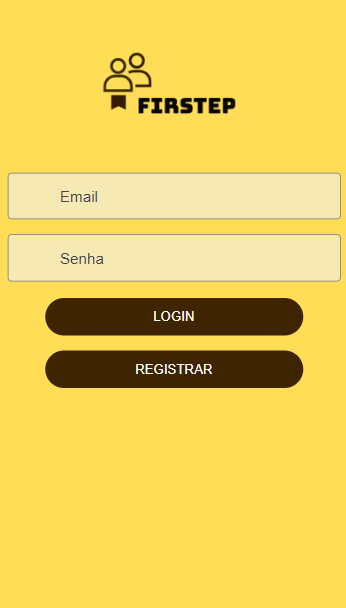
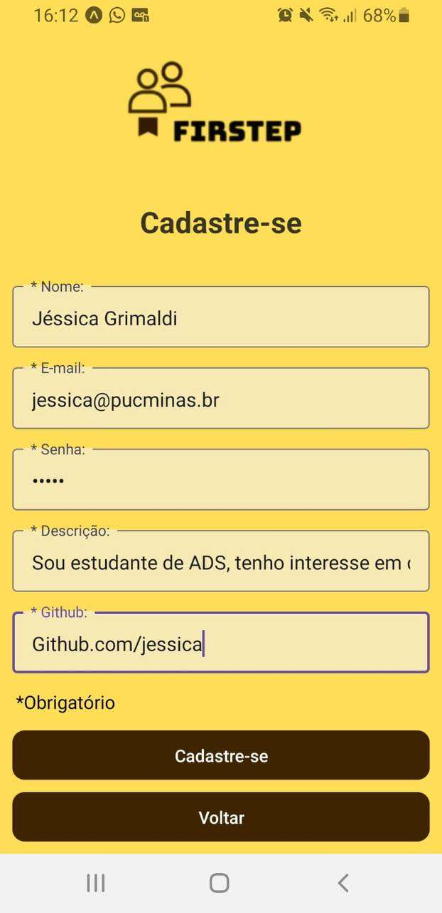
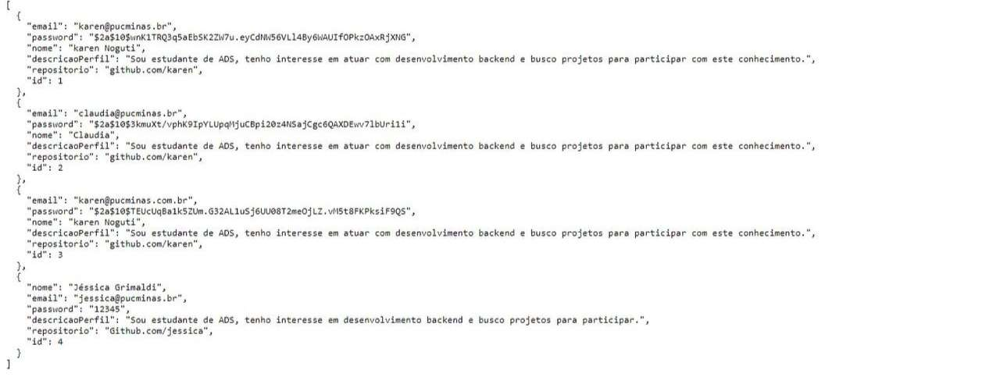
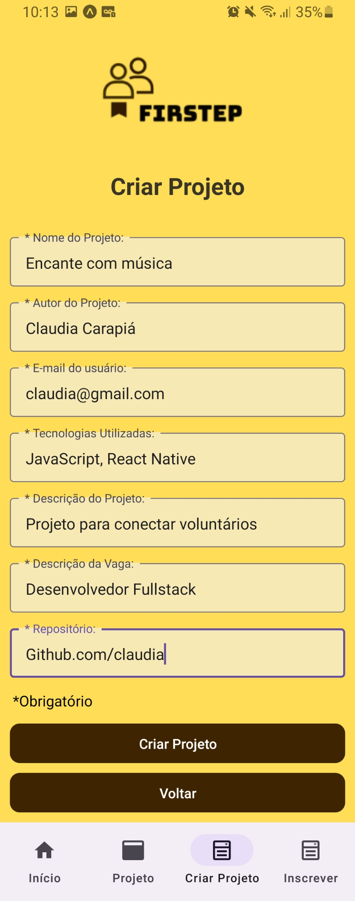
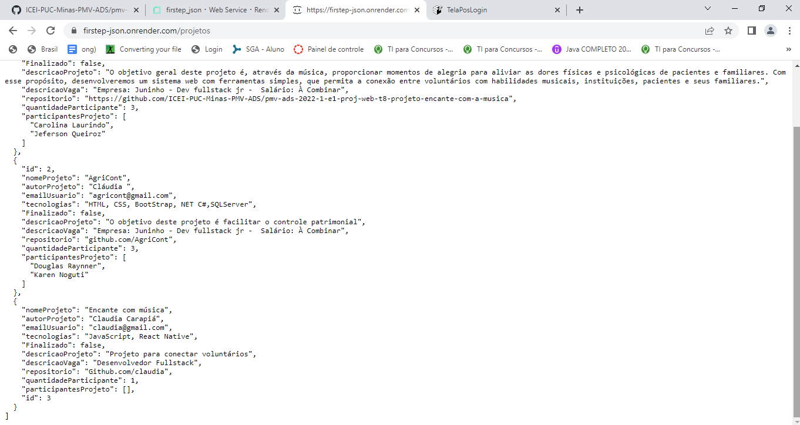
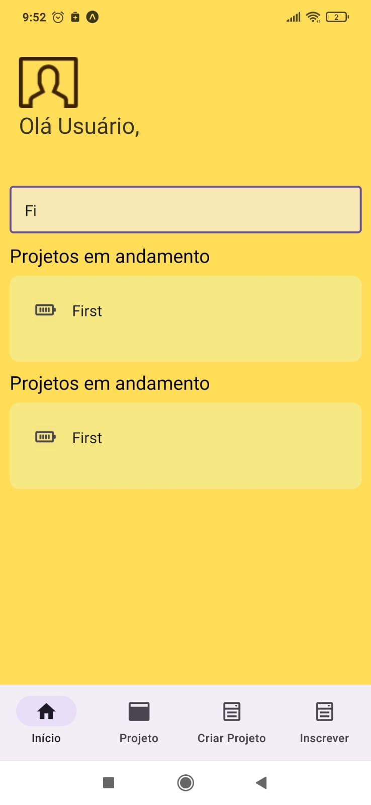

# Registro de Testes de Software

Pré-requisitos: <a href="3-Projeto de Interface.md"> Projeto de Interface</a>, <a href="8-Plano de Testes de Software.md"> Plano de Testes de Software</a>

Relatório com as evidências dos testes de software realizados no sistema pela equipe, baseado em um plano de testes pré-definido.

## CT-01-Tela Login
*Evidência do Teste:** 

**Avaliação:** Houve êxito no teste, pois após o usuário informar e-mail, senha e clicar login ele é direcionado para sua conta.

## CT-02-Tela Cadastro do Usuário

**Evidência do Teste:** 

**Avaliação:** Houve êxito no teste pois, após inserir os dados do usuário e clicar em Cadastre-se, os dados informados foram salvos no Json(https://firstep-json.onrender.com/users).

## CT-03-Tela Cadastro de Projeto

**Evidência do Teste:** 

**Avaliação:** Houve êxito no teste pois, após inserir os dados do projeto para cadastro e clicar no botão Criar Projeto, os dados informados foram salvos no Json(https://firstep-json.onrender.com/projetos).

## CT-05 - Tela Informações do Projeto

**Evidência do Teste:** 

**Avaliação:** Houve êxito no teste, pois ao clicar em um dos projetos na página Pós Login o Get é realizado e depois ao clicar em Candidatar-se na página Inscrever o candidato é inserido no Projeto.

## CT-07-Tela Pós login

**Evidência do Teste:** 

**Avaliação:** Houve êxito no teste pois, após o usuário realizar o login, foi carregada a página que mostra os projetos que o usuário participa, e os projetos em andamento nos quais ele pode se inscrever; 
Ao digitar um nome no campo de busca, apenas projetos que contém o texto informado no campo são mostrados.
Ao clicar no nome do projeto, o usuário é redirecionado para a página desse projeto.

Discorra sobre os resultados do teste. Ressaltando pontos fortes e fracos identificados na solução. Comente como o grupo pretende atacar esses pontos nas próximas iterações. Apresente as falhas detectadas e as melhorias geradas a partir dos resultados obtidos nos testes.

> **Links Úteis**:
> - [Ferramentas de Test para Java Script](https://geekflare.com/javascript-unit-testing/)

