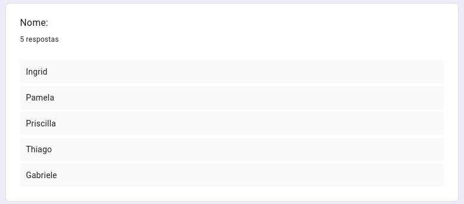
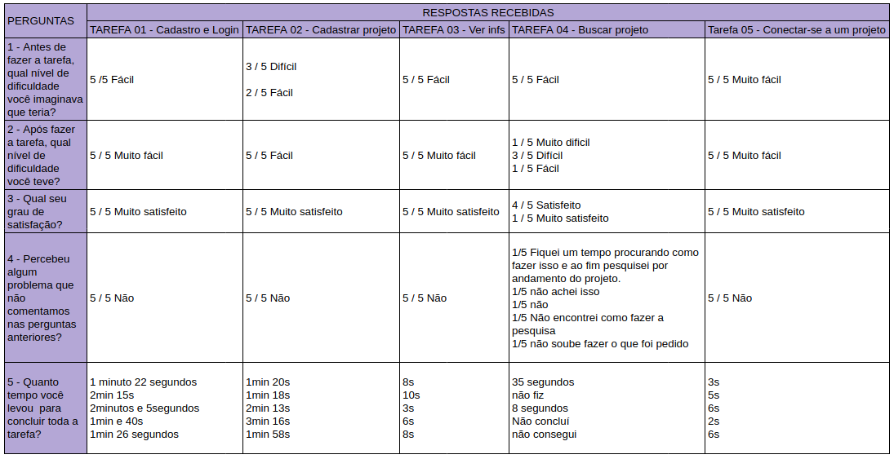
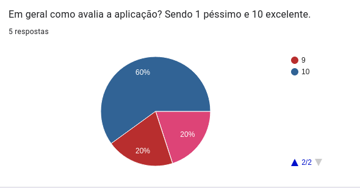
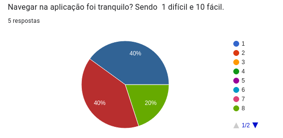
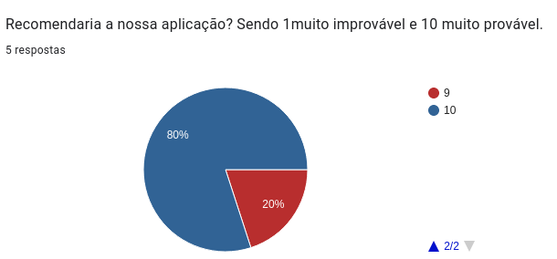

# Registro de Testes de Usabilidade

Para realização dos testes, as pessoas selecionadas receberam e responderam <a href="https://docs.google.com/forms/d/e/1FAIpQLSdDr85Ez5Hut44-QcaJHsqWNeuGFSbAderQeGiTruISgPjq3w/viewform"> este</a> formulário.

Os relatórios abaixo fazem o registro dos participantes e indicam a satisfação dos usuários, em cada tarefa. 

**Registro dos Usuários que participaram do teste:**

## Resultados por tarefa

O quadro abaixo compila os dados informados pelas pessoas participantes.

## Avaliação geral quanto a aplicação

Além da avaliação realizada para cadas tarefa, investigamos também a satisfação geral da aplicação. Os resultados podem ser vistos abaixo:

Podemos notar com os dados acima que das 5 pessoas participantes do teste:
* Sobre a avaliação geral da aplicação: Três avaliam com nota 10, uma com nota 9 e uma com nota 7.
* Sobre a navegabilidade na aplicação: Dois avaliam com nota 10, dois com nota 9 e um com nota 8..
* Sobre recomendar nossa aplicação: Quatro pessoas disseram ser muito provável recomendar nossa aplicação (nota 10), uma diz ser provável (nota 9).

## Relatório
<a href="https://drive.google.com/file/d/1TzjUqS_wBhhpCs3GQkEhe1WmMGCORAYn/view?usp=sharing">Neste</a> relatório apresentamos o compilado das informações aqui apresentadas.
